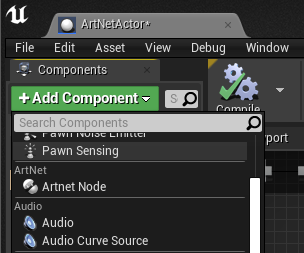
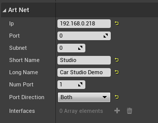
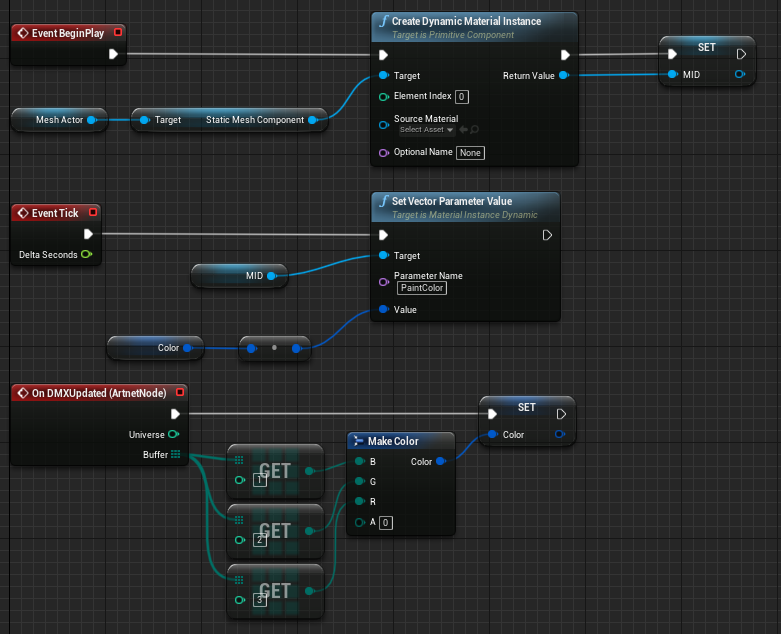
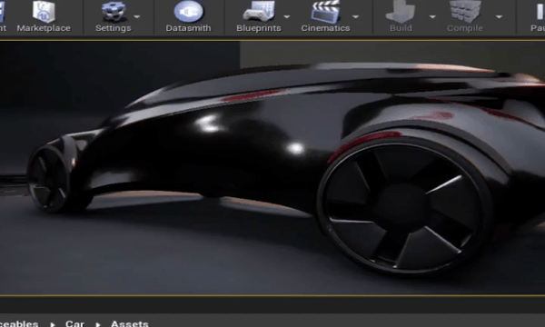
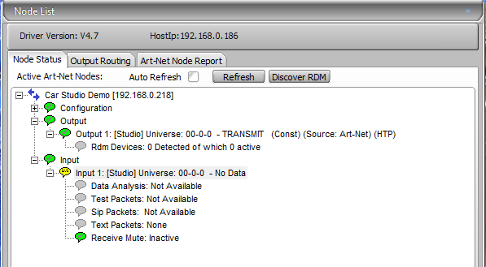

# UE Artnet
Integrate libarnet permitting Actors to be recognized as artnetNode

# Technical Details

* Include C++ Source for C++ Projects.

# Documentation
Create an Actor, and attach a ArnetNode Component to it.

Configure the component by setting your address ip, universe (port) and sub-uni (subnet). Give it a short and long name.
Num Port is used to allow this node to handle more than one universe.
Set the port direction to Both.

This is a small graph of wath you can do with the values.

Ths is the node discovered by DMX-Workshop

# TODO

* Write values to universes

# Support
nicosanta@brightnightgames.net
